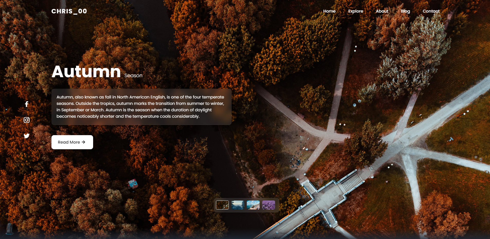

<h1 align="center" id="title">Página de Inicio Responsive para Sitios Turísticos</h1>

Esta es una Página de Inicio de un sitio web diseñada para mostrar diferentes destinos turísticos de mi país. La página incluye un control deslizante de imagen que se puede arrastrar en pantalla completa para una experiencia interactiva.

  
  
<h2>💻 Built with</h2>

Technologies used in the project:

*   HTML: Estructura básica de la página web.
*   CSS: Estilos para el diseño y la apariencia de la página.
*   JavaScript: Funcionalidad del control deslizante de imágenes.

